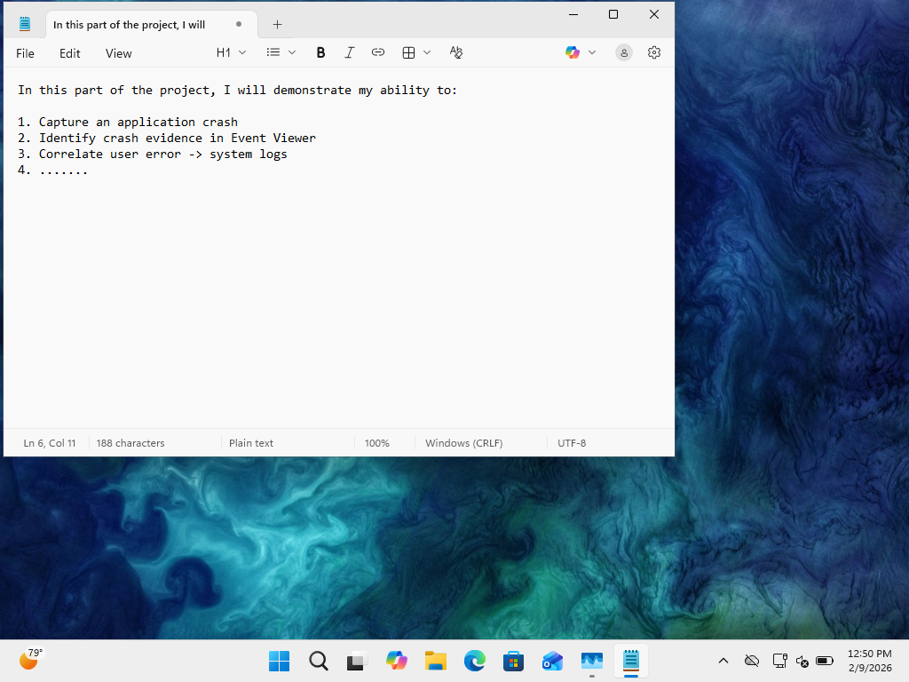
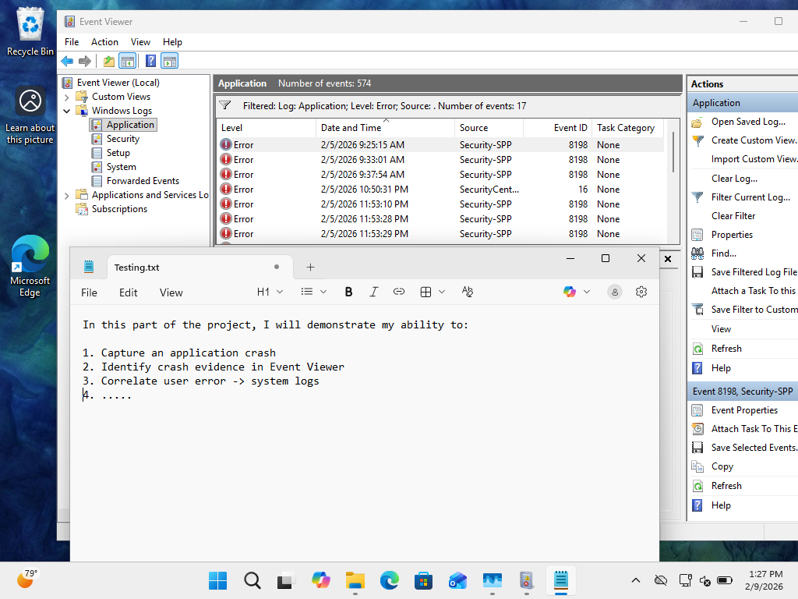

# PHASE 4 — APPLICATION CRASH INCIDENT

## Incident Overview

### Objective

Simulate an application failure scenario to validate process monitoring, recovery procedures, and evidence documentation within an enterprise endpoint environment.

A controlled termination of Notepad was performed to replicate a user-perceived application crash.

---

## Detection

### Symptoms Observed

* Application closed unexpectedly from the user perspective
* Active process disappeared from Task Manager
* Potential risk of unsaved data loss

### Evidence

**Figure 4-1 — Notepad Running Prior to Termination**

**Figure 4-2 — Task Manager Showing Application Before Forced Termination**

---

## Analysis

Event logs were reviewed to determine whether a system-level crash was recorded.

### Findings

* No Notepad crash events were recorded in Event Viewer
* Termination was user-initiated through Task Manager
* Windows typically logs only unhandled application crashes, not manual termination

This behavior aligns with expected Windows process handling.

---

## Root Cause

The incident was intentionally triggered through **forced termination using Task Manager**, simulating a user-reported application crash scenario.

---

## Impact Assessment

* Application session terminated
* Unsaved data potentially lost
* No operating system instability observed
* No background service disruption detected

Impact remained localized to the application process.

---

## Remediation

The application was restarted to verify operational integrity.

### Evidence

**Figure 4-3 — Application Relaunched Successfully**

---

## Verification

Post-recovery validation confirmed:

* Normal application launch
* Stable system performance
* No recurring termination behavior

---

## Lessons Learned

* Forced termination may not generate system logs
* Task Manager provides critical forensic evidence for process-level incidents
* Event Viewer primarily records unhandled crashes rather than administrative termination

---

# Phase 4 Status: Completed

Application failure simulation and recovery validation were successfully completed with no residual system impact.
