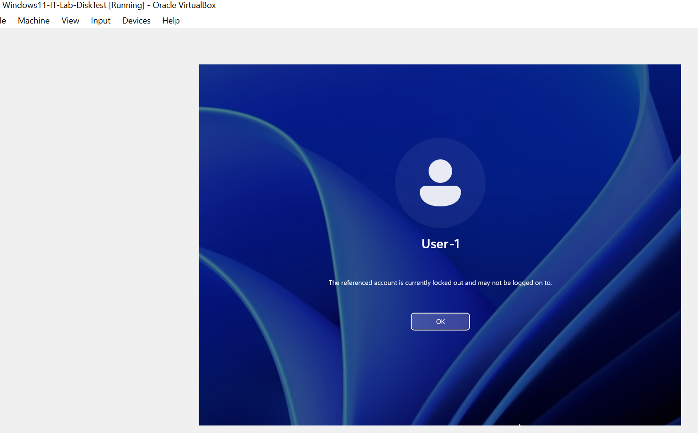

# PHASE 5 — IDENTITY / ACCOUNT LOCKOUT INCIDENT

## Incident Overview

### Objective

Simulate an account lockout scenario to demonstrate identity troubleshooting and administrative recovery procedures within a Windows endpoint environment.

Multiple failed login attempts resulted in user account access restriction.

---

## Detection

### Symptoms Observed

* User unable to authenticate
* System displayed account lockout message after repeated failed attempts

### Evidence

**Figure 5-1 — Baseline Successful Login**

**Figure 5-2 — Account Lockout Message After Failed Attempts**

---

## Environment Constraints

The environment uses Windows Home edition, which does not provide:

* Local Security Policy Editor (`secpol.msc`)
* Local Users and Groups Manager (`lusrmgr.msc`)
* Advanced security auditing controls

Therefore, validation relied on observable authentication behavior rather than detailed audit logs.

---

## Root Cause

The lockout condition occurred due to **multiple consecutive incorrect password attempts**, triggering built-in account protection mechanisms.

---

## Remediation

Administrative recovery actions were performed:

* Logged in using the LocalAdmin account
* Reset user credentials
* Restored account accessibility

---

## Verification

Successful login behavior after remediation confirmed account restoration.

Due to operating system limitations, verification relied on functional testing rather than event log correlation.

---

## Lessons Learned

* Identity incidents can be validated through behavioral evidence when audit tools are unavailable
* Administrative recovery paths must be maintained for endpoint resilience
* OS edition limitations affect forensic visibility

---

# Phase 5 Identity Status: Completed

Account lockout scenario successfully simulated and resolved through administrative intervention.
