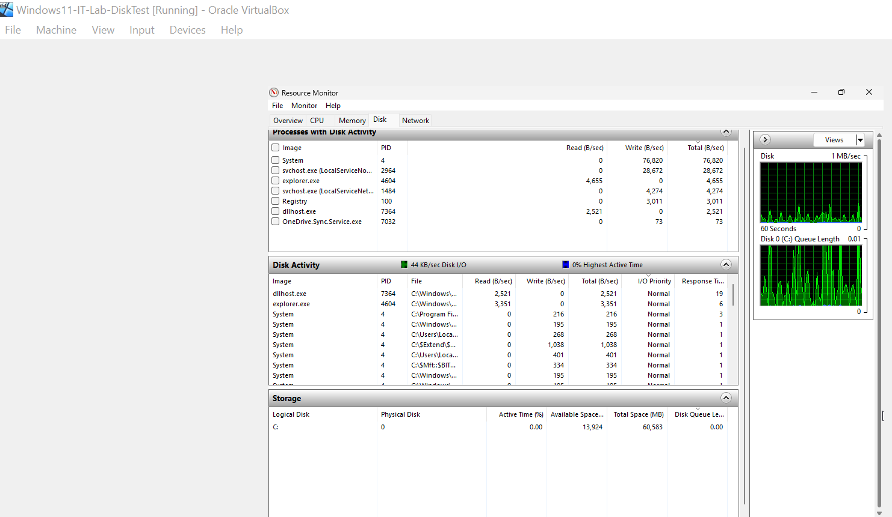
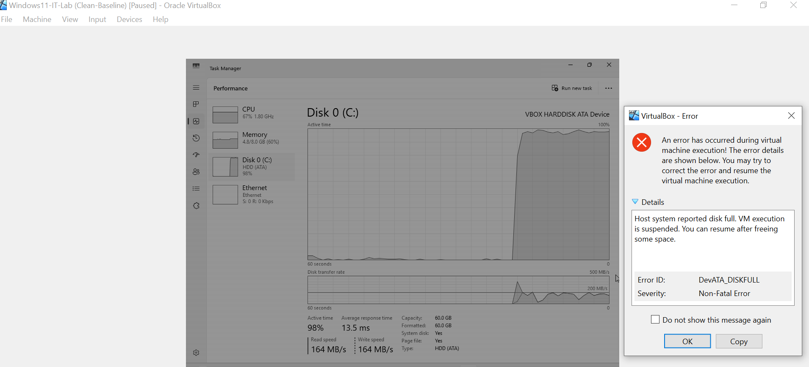
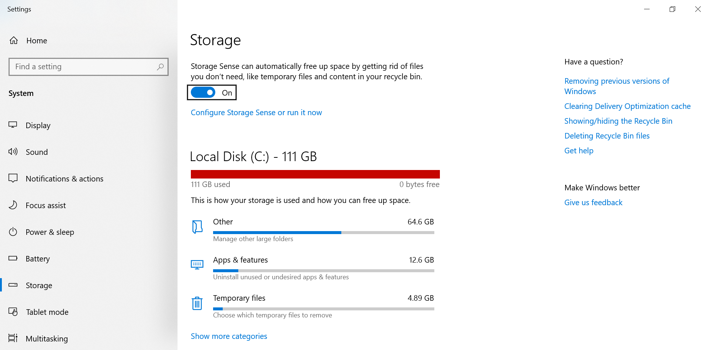

# PHASE 3 — VM STORAGE EXHAUSTION INCIDENT

## Incident Overview

### Objective

Investigate virtual machine instability caused by host storage exhaustion and analyze the relationship between host capacity and VM performance.

---

## Baseline Observation

Initial system state confirmed normal disk behavior.

### Evidence

**Figure 3-11 — Disk Idle State**

**Figure 3-12 — Resource Monitor Idle Metrics**

### Findings

* Low disk utilization
* No queue buildup
* Normal responsiveness

---

## Storage Exhaustion Event

Disk consumption increased significantly during testing, triggering system instability.

### Evidence

**Figure 3-13 — Disk Capacity Near Limit**

**Figure 3-14 — VM Paused Due to Storage Exhaustion**

**Figure 3-15 — Host System Storage Alert**

---

## Performance Analysis

### Evidence

**Figure 3-16 — Disk Saturation During Workload**

**Figure 3-17 — Queue Length and Active Processes**

### Findings

* Disk active time approached maximum utilization
* Queue buildup indicated I/O contention
* Performance degradation correlated with disk pressure

---

## Root Cause

### Primary Cause

Excessive disk consumption inside the virtual machine environment.

### Contributing Factors

* Limited virtual disk capacity
* Insufficient host storage monitoring
* Snapshot storage overhead

---

## Remediation

Corrective actions performed:

* Removed unnecessary files
* Freed host storage space
* Stabilized VM environment

### Evidence

**Figure 3-18 — Disk Performance Normalized**

---

## Verification

Post-remediation validation confirmed:

* Normal disk utilization
* Stable system performance
* No VM pauses observed

---

## Lessons Learned

* Host storage capacity directly impacts VM reliability
* Capacity planning is essential in virtual environments
* Monitoring prevents unexpected outages

---

# Phase 3 Status: Completed

Storage exhaustion incident successfully analyzed and resolved with restored system stability.
