# PHASE 0 — LAB PREPARATION

## STEP 0.1 — Virtual Machine Configuration

### Objective
Establish a controlled enterprise-style Windows endpoint environment for testing and incident simulation.

### Configuration

- Guest OS: Windows 11 Home  
- CPU: 2 vCPU  
- RAM: 8 GB  
- Storage: 60 GB virtual disk  
- Network: NAT adapter  

### Evidence

**Figure 0-1 — Virtual Machine Hardware Configuration**

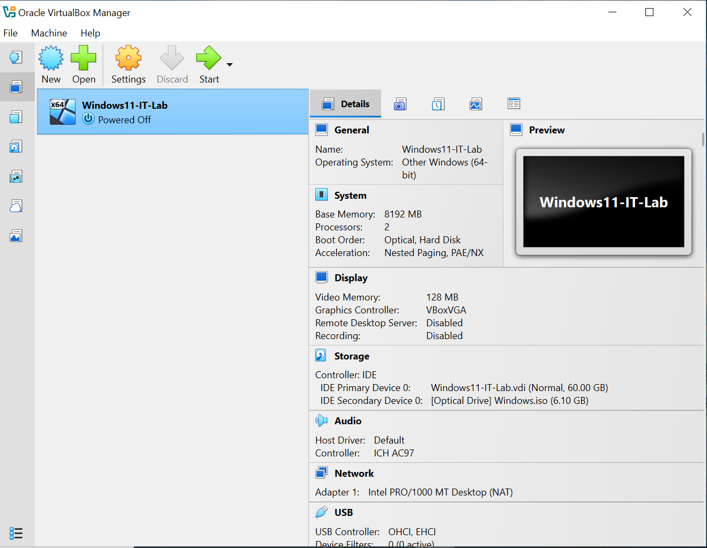

### Outcome
The virtual machine was provisioned with sufficient compute, memory, and storage resources to support performance monitoring, troubleshooting, and security validation tasks.

---

## STEP 0.2 — User Account Model

### Objective
Simulate enterprise privilege separation using multiple user roles.

### Accounts Created

- LocalAdmin — Administrator  
- User-1 — Standard User  
- User-2 — Standard User  

### Evidence

**Figure 0-2 — Local User Accounts**

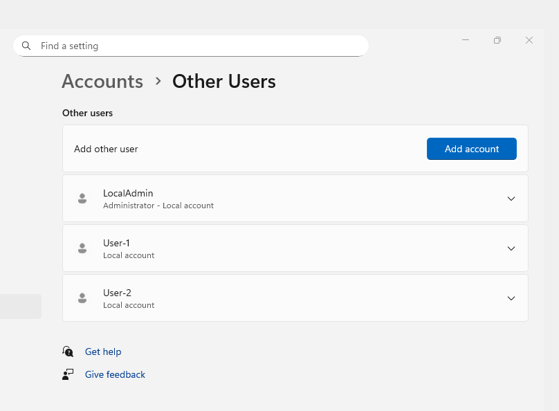

### Outcome
The multi-user model enables:

- Least privilege validation  
- Identity incident simulation  
- Administrative recovery testing  

---

## STEP 0.3 — Snapshot Strategy

### Objective
Preserve a known-good system state for repeatable testing and rollback capability.

A snapshot named **Clean-Baseline** was created after initial configuration.

### Evidence

**Figure 0-3 — Clean Baseline Snapshot**

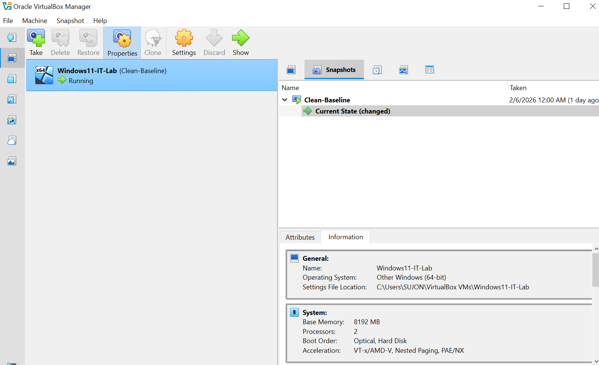

### Outcome
The snapshot provides:

- Rapid recovery after incidents  
- Protection of baseline integrity  
- Repeatable testing conditions  

---

# PHASE 1 — ENDPOINT BASELINE

## STEP 1.1 — OS Version & Patch Status

### Objective
Verify operating system version and ensure the system is fully patched.

The OS version was confirmed using `winver`.

### Evidence

**Figure 1-1 — Windows Version Information**

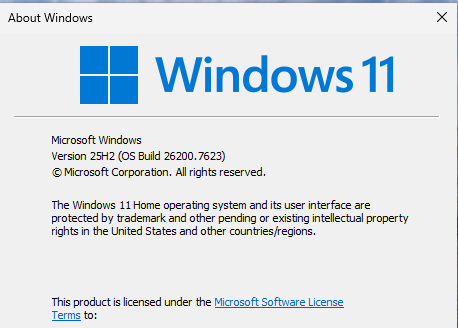

Initial update checks revealed failed updates.

**Figure 1-2 — Windows Update Failure**

Remediation actions performed:

- Retried Windows Update  
- Installed pending patches  

Final verification confirmed successful installation.

**Figure 1-3 — Windows Fully Updated**

### Outcome
The system reached a fully patched and compliant baseline state.

---

## STEP 1.2 — Hardware & Resource Baseline

### Objective
Measure baseline system resource utilization under idle conditions.

Measurements were collected using Task Manager Performance Monitor.

### Evidence

**Figure 1-4 — CPU Performance Baseline**

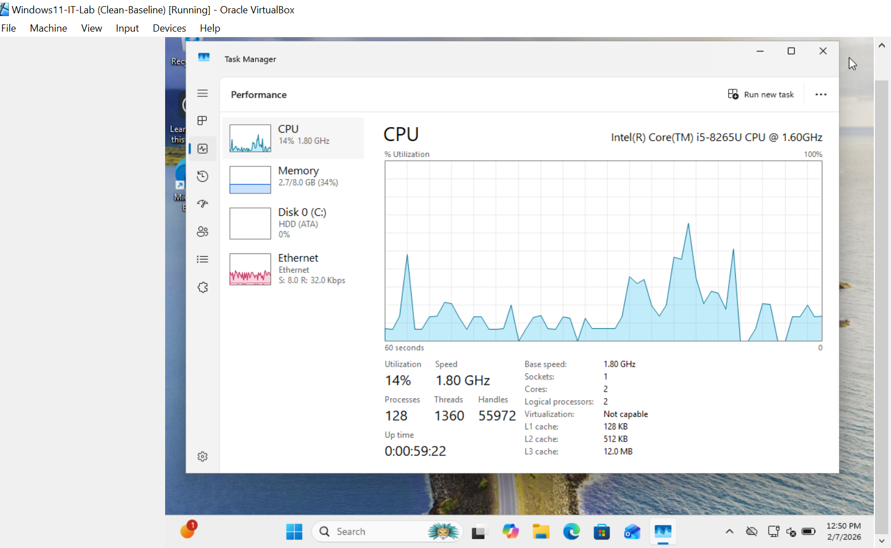

**Figure 1-5 — Memory Performance Baseline**

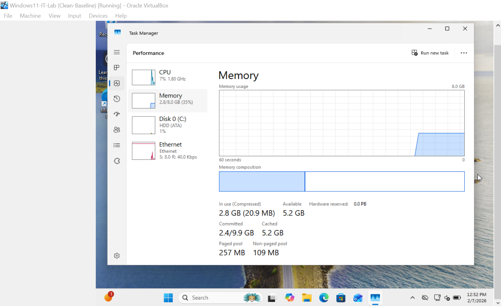

**Figure 1-6 — Disk Performance Baseline**

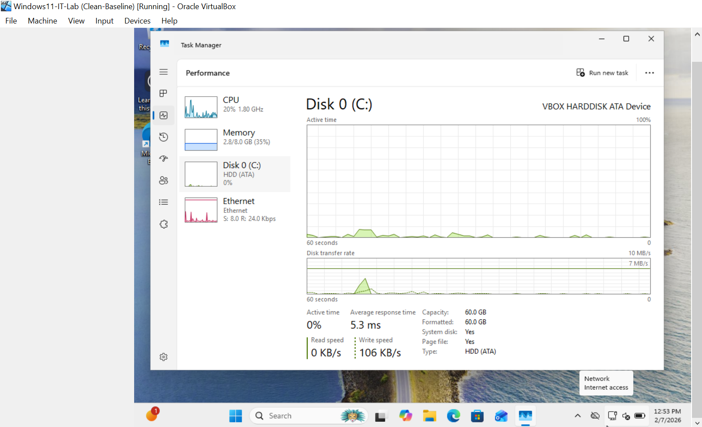

**Figure 1-7 — Network Performance Baseline**

### Observation

- Stable CPU utilization at idle  
- Adequate available memory  
- Normal disk activity  
- Stable network connectivity  

### Outcome
Baseline performance metrics were documented for comparison during incident simulations.

---

## STEP 1.3 — Startup Applications

### Objective
Review startup programs to identify potential performance impact factors.

### Evidence

**Figure 1-8 — Startup Applications List**

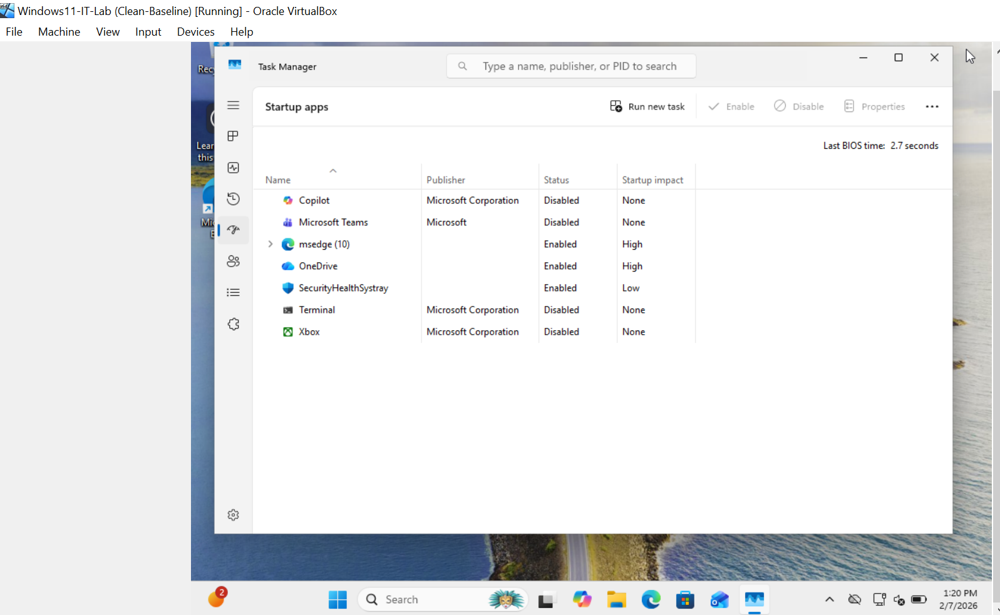

### Observation
Several applications with measurable startup impact were intentionally retained to support later performance testing scenarios.

---

## STEP 1.4 — Critical Services Verification

### Objective
Confirm operational status of essential Windows services required for normal system functionality.

Services inspected included:

- DHCP Client  
- DNS Client  
- Windows Defender  
- Windows Event Log  

### Evidence

**Figure 1-9 — Critical Services Status (Part 1)**

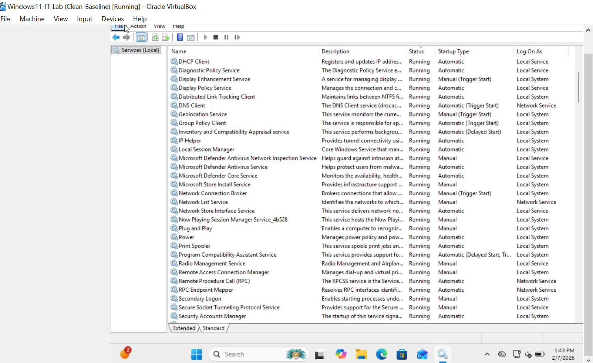

**Figure 1-10 — Critical Services Status (Part 2)**

### Outcome
All critical services were running normally with no anomalies observed.

---

## STEP 1.5 — Security Baseline

### Objective
Validate that core security controls were active prior to incident testing.

### Evidence

**Figure 1-11 — Microsoft Defender Status**

**Figure 1-12 — Windows Firewall Status**

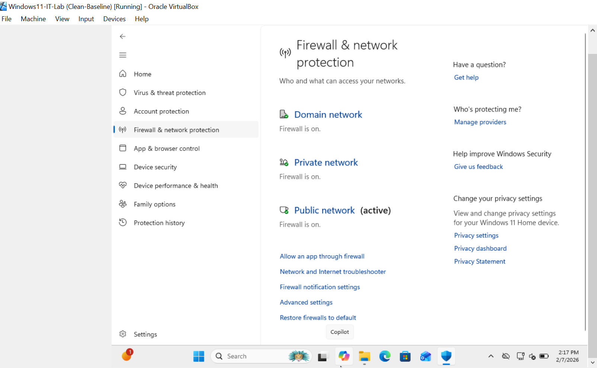

### Outcome
Endpoint protection and firewall controls were confirmed operational.

---

## STEP 1.6 — Event Log Baseline

### Objective
Capture baseline Windows event logs for future comparison during incident analysis and forensic validation.

System logs were reviewed using Event Viewer and exported in native `.evtx` format for preservation.

---

### Evidence

**Figure 1-13 — Event Viewer Overview**

---

### Baseline Log Exports

The following baseline logs were exported and stored for reference:

Baseline-Event-Logs/

- Baseline-System.evtx  
- Baseline-Security.evtx  
- Baseline-Application.evtx  

> Note: `.evtx` files are native Windows Event Log formats and cannot be previewed directly on GitHub.  
> They can be opened locally using **Event Viewer** for detailed forensic analysis.

---

### Purpose of Baseline Logs

These baseline logs serve several security and operational purposes:

- Establish normal system behavior before incidents
- Enable comparison during anomaly detection
- Support forensic investigations
- Validate alerts generated by SIEM tools (e.g., Wazuh)
- Provide evidence of system state at project start

---

### Outcome
Baseline system activity was successfully captured and preserved, enabling reliable comparison during future incident response and security monitoring phases.

---

## STEP 1.7 — Least Privilege Validation

### Objective
Verify that standard users cannot perform administrative actions without elevation.

### Evidence

**Figure 1-14 — Standard User Permission Restriction**

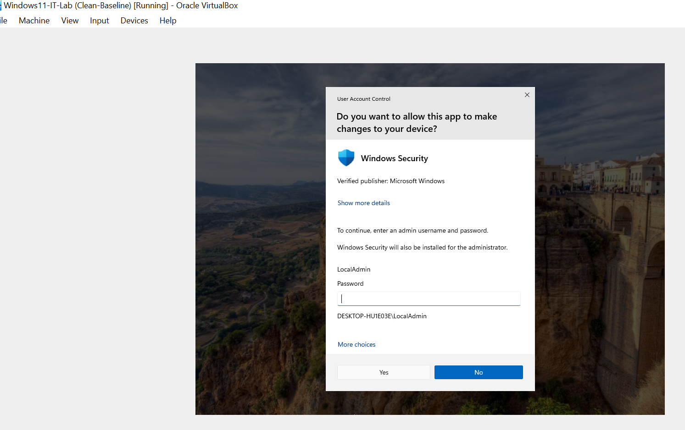

### Outcome
Least privilege enforcement was confirmed. Administrative privileges required elevation credentials.

---

# Phase 1 Status: Completed

Baseline configuration, security controls, and system health metrics were successfully validated and documented.
