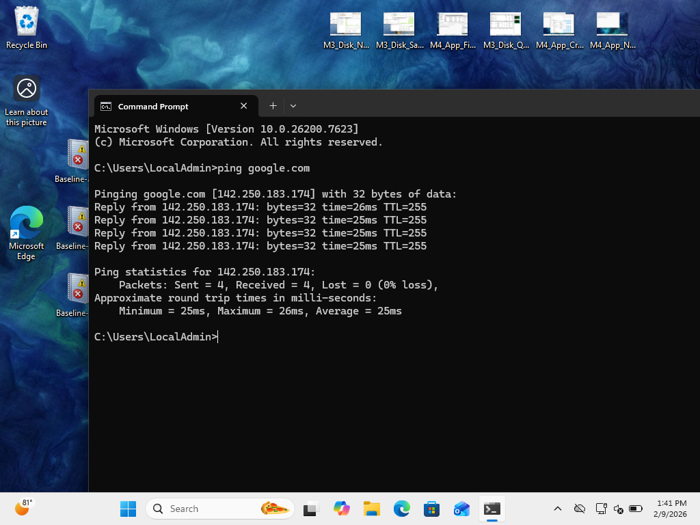
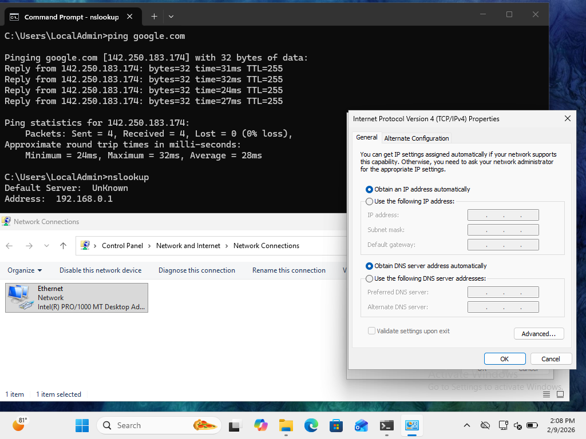

# PHASE 5 — NETWORK FAILURE INCIDENT (DNS MISCONFIGURATION)

## Incident Overview

### Objective

Simulate a DNS resolution failure to demonstrate network troubleshooting methodology and recovery validation.

Connectivity disruption was introduced through incorrect DNS configuration.

---

## Detection

### Baseline Validation

DNS functionality was confirmed prior to failure simulation.

### Evidence

**Figure 5-3 — Baseline DNS Resolution**

---

## Failure Simulation

DNS server configuration was manually modified to invalid addresses.

### Evidence

**Figure 5-4 — Incorrect DNS Configuration**

**Figure 5-5 — Name Resolution Failure**

---

## Analysis

### Findings

* Domain name resolution failed
* Network connectivity existed but could not translate hostnames
* Issue isolated to DNS layer rather than physical connectivity

This confirmed a configuration-level fault.

---

## Root Cause

The incident was caused by **invalid DNS server configuration**, preventing hostname resolution and internet access.

---

## Remediation

DNS configuration was restored to automatic assignment.

### Evidence

**Figure 5-6 — DNS Configuration Restored**

---

## Verification

Post-remediation testing confirmed:

* Successful domain resolution
* Restored network connectivity
* Normal system behavior

---

## Lessons Learned

* DNS failures can mimic full network outages
* Baseline connectivity validation is critical during troubleshooting
* Configuration errors are a common root cause in endpoint incidents

---

# Phase 5 Network Status: Completed

Network connectivity disruption was successfully simulated, diagnosed, and resolved.
