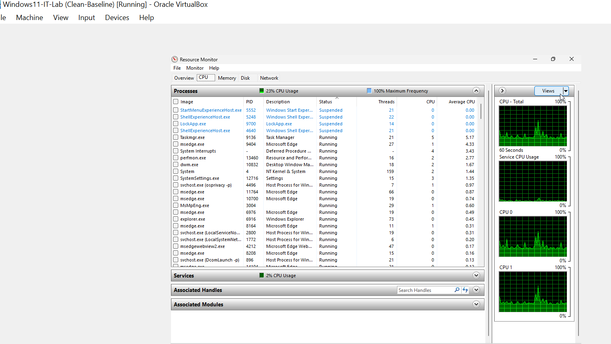
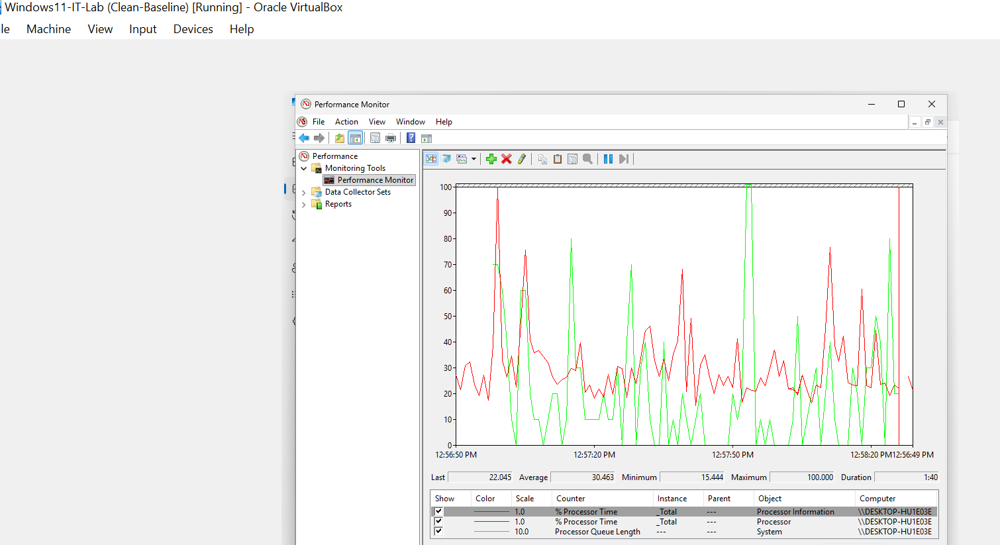
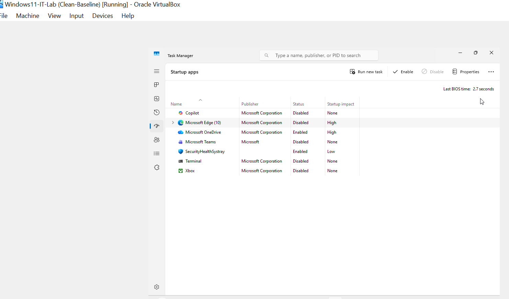

# PHASE 2 — CPU PERFORMANCE INCIDENT (ROOT CAUSE ANALYSIS)

## Incident Overview

### Objective

Simulate and investigate sustained CPU utilization to demonstrate performance monitoring, root cause identification, and remediation workflow in an enterprise endpoint environment.

During testing, the system exhibited persistent high CPU consumption resulting in degraded responsiveness.

---

## Detection

### Symptoms Observed

* Elevated CPU utilization
* Sluggish system response
* Delayed application execution

### Evidence

**Figure 2-1 — CPU Saturation Detected in Task Manager**

CPU usage significantly exceeded the established idle baseline (~0–2%).

---

## Analysis

### Diagnostic Tools Used

* Task Manager
* Resource Monitor
* Performance Monitor (PerfMon)

These tools were used to confirm abnormal processor activity and identify contributing processes.

### Evidence

**Figure 2-2 — CPU Activity in Resource Monitor**

**Figure 2-3 — CPU Utilization Trend in Performance Monitor**

### Findings

* Continuous processor load observed across multiple processes
* Sustained utilization pattern confirmed abnormal behavior relative to baseline
* System responsiveness correlated directly with CPU spikes

---

## Root Cause

The primary cause of CPU saturation was **high-impact startup applications generating continuous background workload**, exceeding the system’s baseline processing capacity.

---

## Remediation

### Corrective Action

* Identified high-impact startup applications
* Disabled unnecessary startup entries to reduce background load

### Evidence

**Figure 2-4 — Startup Applications Disabled**

---

## Verification

System performance was reassessed following remediation.

### Evidence

**Figure 2-5 — CPU Utilization Returned to Baseline**

### Result

* CPU usage returned to expected idle range
* System responsiveness restored
* No abnormal processor spikes detected

---

## Outcome

This incident demonstrates:

* Performance anomaly detection
* Structured troubleshooting methodology
* Root cause validation
* Controlled remediation
* Post-fix performance verification

---

# Phase 2 Status: Completed

CPU performance degradation was successfully analyzed and resolved, confirming stable system operation.
