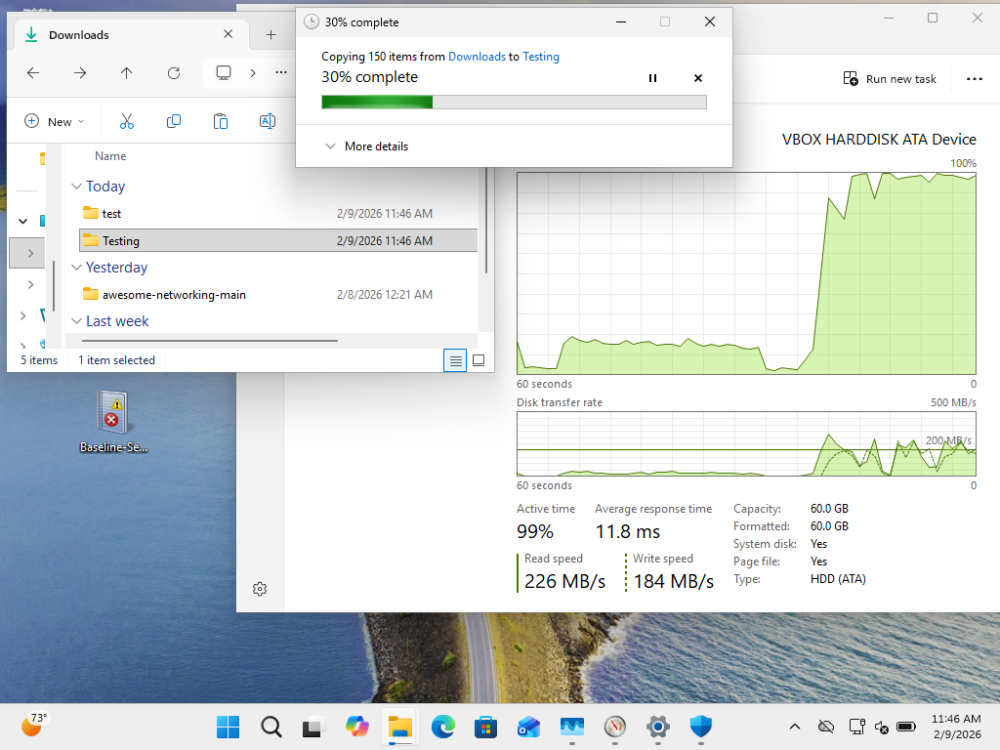
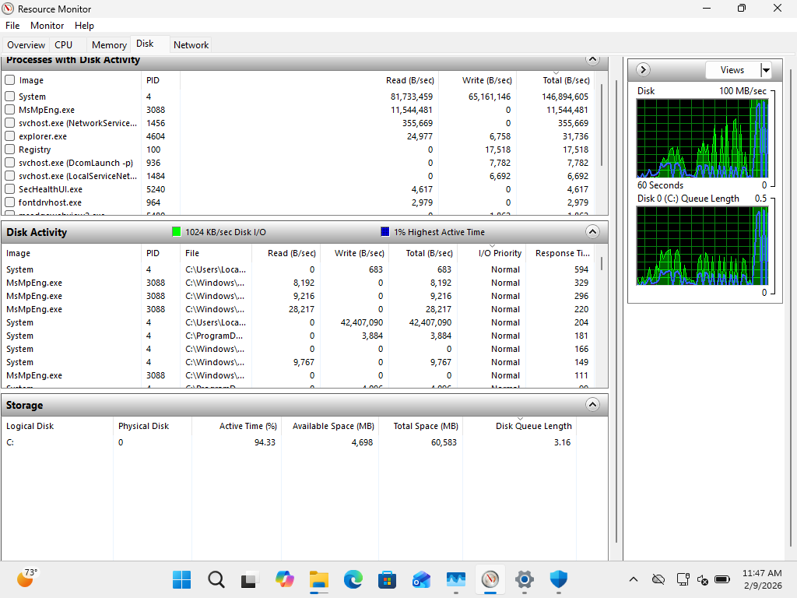
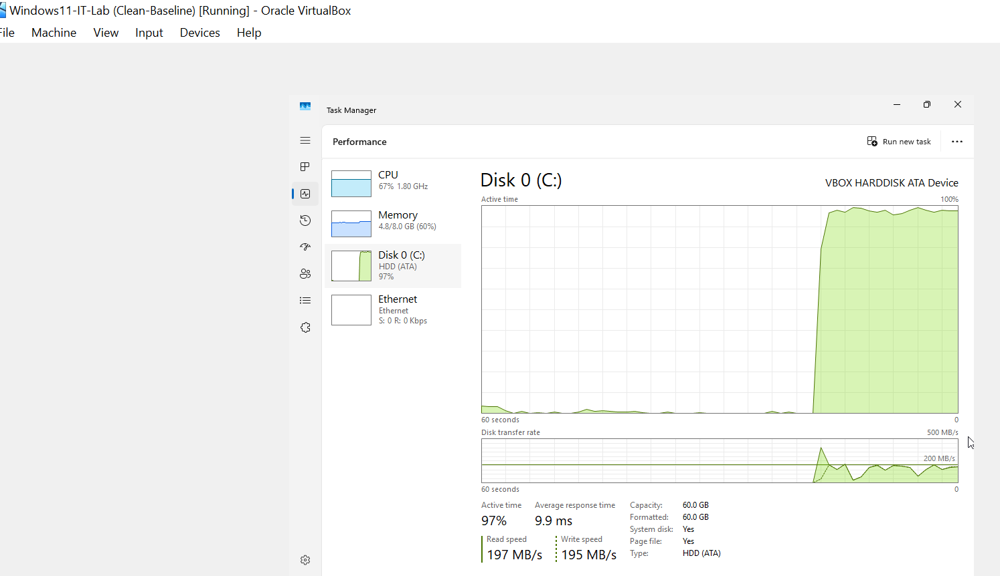
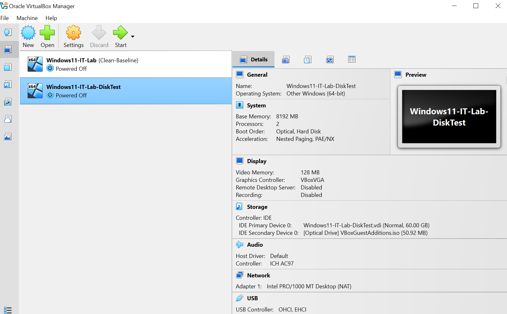
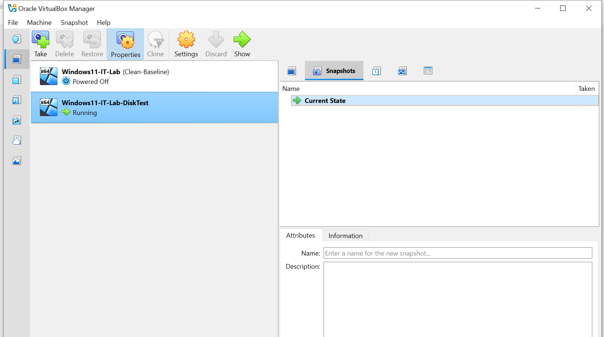
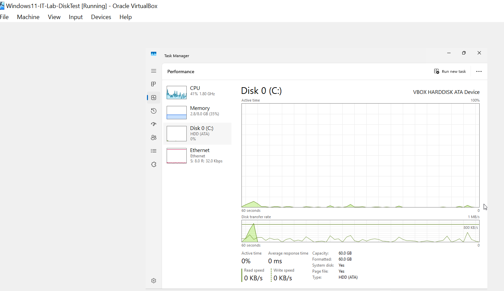
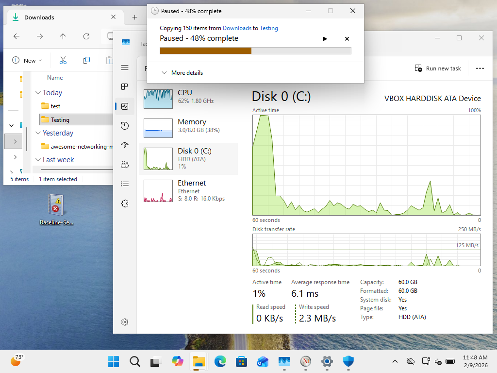

# PHASE 3 — DISK BOTTLENECK & STORAGE EXHAUSTION INCIDENT (ROOT CAUSE ANALYSIS)

## Incident Overview

### Objective

Simulate disk I/O saturation and analyze system behavior under storage stress conditions, including hypervisor-level resource constraints.

The system experienced severe disk utilization that degraded performance and ultimately caused virtual machine instability.

---

## Detection

### Symptoms Observed

* Slow application response
* High disk activity
* System lag during file operations
* Reduced responsiveness

### Evidence

**Figure 3-1 — Disk Saturation Observed in Task Manager**

Disk active time approached maximum utilization thresholds.

---

## Analysis

### Diagnostic Tools Used

* Task Manager
* Resource Monitor

### Evidence

**Figure 3-2 — Disk Queue Length and Top Processes**

**Figure 3-3 — Disk Behavior Under Idle Conditions**

### Findings

* Disk active time approached 100% during workload
* Increased queue length indicated I/O contention
* Multiple concurrent disk operations created resource bottleneck

---

## Escalation — Storage Exhaustion Event

During testing, the host system ran out of available storage, causing the hypervisor to pause the virtual machine automatically.

### Evidence

**Figure 3-4 — Disk Utilization Near Capacity**

**Figure 3-5 — Virtual Machine Paused Due to Storage Exhaustion**

**Figure 3-6 — Host Storage Alert**

This confirmed dependency between host storage availability and virtual machine stability.

---

## Root Cause

### Primary Cause

Concurrent disk-intensive operations (file copying and security scanning) saturated the virtual disk I/O capacity.

### Secondary Cause

Host machine storage exhaustion triggered hypervisor protective behavior, pausing the VM to prevent corruption.

---

## Remediation

### Immediate Recovery Actions

* Stopped disk-intensive workloads
* Freed host storage space
* Resumed virtual machine operation

### Structural Improvement

To prevent recurrence:

* Cloned the virtual machine to a storage drive with sufficient capacity
* Removed snapshot dependency to reduce disk overhead

### Evidence

**Figure 3-7 — Clone Configuration**

**Figure 3-8 — Full Clone Without Snapshots**

---

## Verification

System performance was validated after remediation.

### Evidence

**Figure 3-9 — Disk Activity Returned to Idle**

**Figure 3-10 — Disk Performance Normalized After Workload**

### Result

* Disk utilization returned to baseline range
* No abnormal queue length observed
* VM stability restored

---

## Lessons Learned

* Disk queue length is a critical indicator beyond utilization percentage
* Host storage capacity directly impacts VM reliability
* Snapshot-dependent environments increase storage risk
* Security scans can significantly affect I/O-bound systems

---

# Phase 3 Status: Completed

Disk performance degradation and storage exhaustion were successfully analyzed, remediated, and validated, restoring stable system operation.
