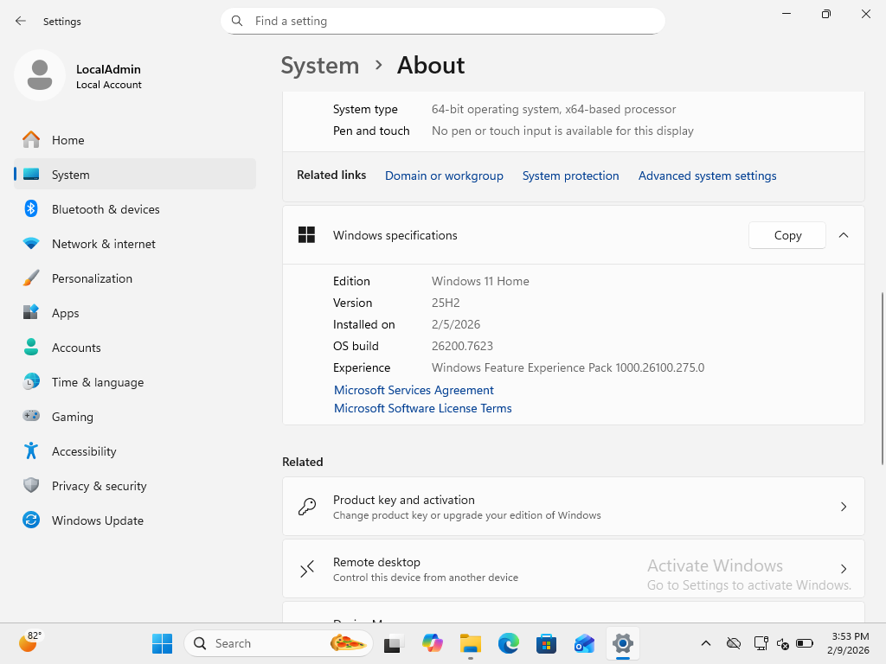

# PHASE 6 — SECURITY HARDENING ANALYSIS

## Objective

Validate endpoint protection mechanisms following completion of incident simulation phases to ensure the system meets baseline security standards.

This phase focuses on antivirus status, firewall protection, operating system limitations, and patch management verification.

---

## STEP 6.1 — Microsoft Defender Antivirus Status

Windows Defender status was reviewed through **Windows Security → Virus & threat protection**.

### Observations

* No active threats detected
* Security intelligence definitions up to date
* Recent quick scan completed successfully
* Endpoint protection operational

### Evidence

**Figure 6-1 — Microsoft Defender Protection Status**

---

## STEP 6.2 — Windows Defender Firewall Status

Firewall configuration was verified via **Control Panel → Windows Defender Firewall**.

### Observations

* Firewall enabled across all network profiles
* Default protection posture maintained
* No unauthorized profile disablement detected

### Evidence

**Figure 6-2 — Firewall Enabled Across Profiles**

---

## STEP 6.3 — Operating System Edition Context

Operating system edition was reviewed to determine available security capabilities.

### Observations

The environment uses Windows Home edition, which introduces the following limitations:

* No Group Policy Editor
* No BitLocker management interface
* Limited advanced auditing configuration

These constraints were considered during hardening validation.

### Evidence

**Figure 6-3 — Windows Edition Information**

---

## STEP 6.4 — Patch Management Verification

System update status was reviewed via **Settings → Windows Update**.

### Observations

* System fully patched
* No pending updates
* Update history confirms recent installation activity

### Evidence

**Figure 6-4 — Windows Update History**

---

## Security Posture Summary

Baseline endpoint protections were verified as operational:

* Antivirus active
* Firewall enabled
* System patched
* No unresolved security alerts

---

# Phase 6 Status: Completed

Security controls were successfully validated, confirming a hardened baseline suitable for continued monitoring and testing.
