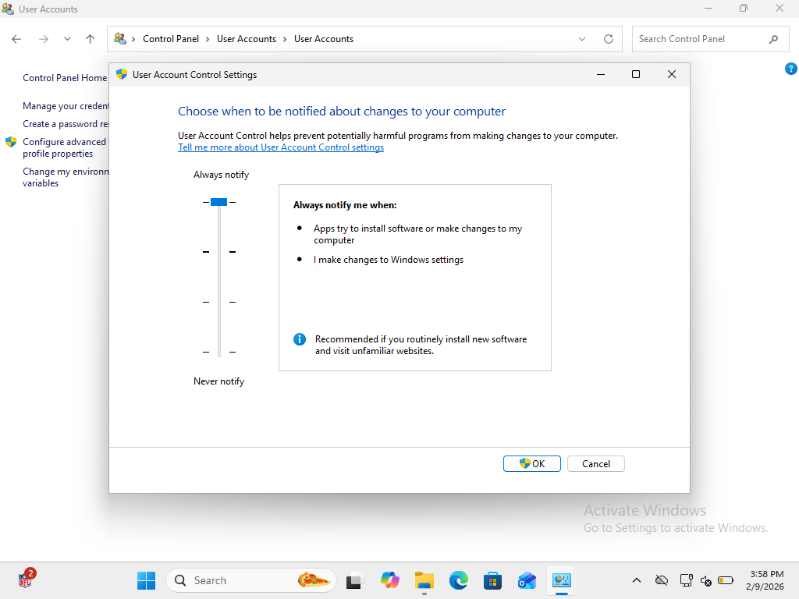

# PHASE 6 — SECURITY HARDENING CHECKLIST

## Objective

Apply and verify foundational security controls on the Windows endpoint following incident resolution to ensure system resilience and adherence to security best practices.

---

## STEP 6.1 — Microsoft Defender Antivirus Verification

### Action

Opened **Windows Security → Virus & threat protection**.

### Observations

* No threats detected
* Quick scan completed successfully
* Security intelligence updated
* Defender protection active

Note: Windows Home edition does not always display an explicit “Real-time protection” toggle, but active scanning confirms operational status.

### Evidence

**Figure 6-5 — Defender Operational Status**

---

## STEP 6.2 — Windows Defender Firewall Verification

### Action

Opened **Control Panel → System and Security → Windows Defender Firewall**.

### Observations

* Firewall enabled for all network profiles
* Default security posture intact
* No profile disabled

### Evidence

**Figure 6-6 — Firewall Protection Enabled**

---

## STEP 6.3 — Disk Encryption Capability Review

### Action

Checked **Control Panel → System and Security** for BitLocker availability.

### Observations

* BitLocker management not present
* No encryption configuration interface available

### Conclusion

Limitation is due to operating system edition rather than misconfiguration.

### Evidence

**Figure 6-7 — Windows Edition Confirmation**

---

## STEP 6.4 — Windows Update Validation

### Action

Reviewed **Windows Update settings and history**.

### Observations

* System fully updated
* No pending patches
* Recent updates successfully installed

### Evidence

**Figure 6-8 — Windows Update History**

---

## STEP 6.5 — User Account Security Baseline

### Action

Reviewed account configuration and User Account Control (UAC) settings.

### Observations

* Dedicated LocalAdmin account present
* Standard user accounts configured
* Administrative privileges restricted
* UAC prompts enforced for elevation

This configuration supports **least privilege enforcement** and administrative recovery capability.

### Evidence

**Figure 6-9 — UAC Security Configuration**

---

## Hardening Summary

The endpoint environment demonstrates the following security controls:

* Active antivirus protection
* Firewall enforcement
* System patch compliance
* Privilege separation
* User elevation safeguards

All controls were verified with supporting evidence.

---

# Phase 6 Hardening Status: Completed

Baseline security posture successfully established and validated.
